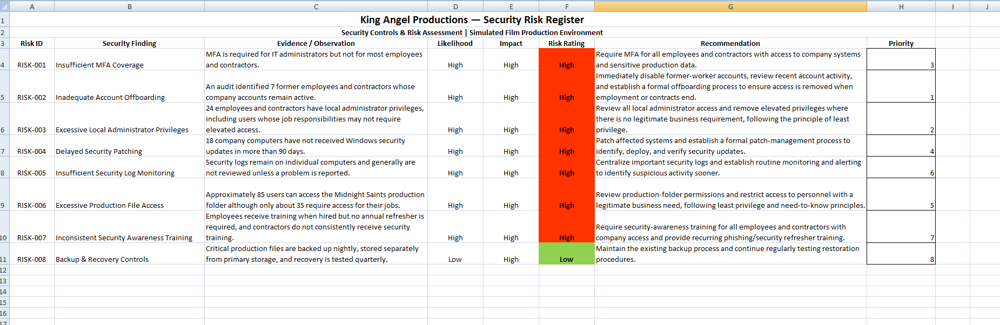
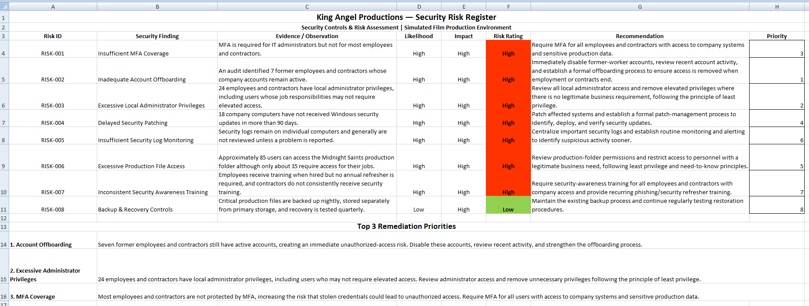

Project screenshots and evidence.
# Security Controls & Risk Assessment

## Overview

This project documents a simulated security controls and risk assessment performed for **King Angel Productions**, a fictional film production company.

The assessment evaluated security controls protecting sensitive business and production assets, including unreleased scripts, film footage, contracts, employee information, internal communications, and other confidential production data.

The goal was to identify security control gaps, evaluate their potential likelihood and business impact, prioritize the identified risks, and develop practical remediation recommendations.

## Assessment Scope

The assessment reviewed controls related to:

- Multi-Factor Authentication (MFA)
- Employee and contractor offboarding
- Local administrator privileges
- Security patch management
- Security logging and monitoring
- Access to confidential production files
- Security awareness training
- Backup and recovery

## Methodology

Each security control was reviewed using the information provided in the simulated environment. For each identified risk, I:

1. Identified the security control gap and supporting evidence.
2. Evaluated the likelihood that the weakness could contribute to a security incident.
3. Evaluated the potential business impact if the risk were exploited.
4. Assigned an overall risk rating of Low, Medium, or High.
5. Developed a remediation recommendation based on the finding.
6. Prioritized findings based on urgency, existing exposure, and potential impact to the organization.

## Key Findings

The assessment identified seven high-risk security control gaps and one control that appeared effective based on the available information.

| ID | Finding | Likelihood | Impact | Risk |
|---|---|---|---|---|
| RISK-001 | Insufficient MFA Coverage | High | High | High |
| RISK-002 | Inadequate Account Offboarding | High | High | High |
| RISK-003 | Excessive Local Administrator Privileges | High | High | High |
| RISK-004 | Delayed Security Patching | High | High | High |
| RISK-005 | Insufficient Security Log Monitoring | High | High | High |
| RISK-006 | Excessive Production File Access | High | High | High |
| RISK-007 | Inconsistent Security Awareness Training | High | High | High |
| RISK-008 | Backup & Recovery Controls | Low | High | Low |

### Completed Risk Register

The full risk register documents the evidence, likelihood, impact, risk rating, remediation recommendation, and priority assigned to each control reviewed.

## Top 3 Remediation Priorities

Although multiple high-risk findings were identified, I prioritized the following three issues for remediation based on urgency, existing exposure, and potential impact.

### 1. Account Offboarding

Seven former employees and contractors still had active company accounts. I ranked this as the highest priority because these users no longer had a legitimate business need for access, creating an existing unauthorized-access risk.

**Recommended Action:** Immediately disable the accounts, review recent account activity, and establish a formal offboarding process to ensure access is removed when employment or contracts end.

### 2. Excessive Administrator Privileges

Twenty-four employees and contractors had local administrator privileges, including users whose responsibilities may not require elevated access.

**Recommended Action:** Review administrator privileges and remove elevated access where there is no legitimate business requirement, following the principle of least privilege.

### 3. Insufficient MFA Coverage

MFA was required for IT administrators but not for most employees and contractors. Compromised credentials could therefore potentially provide unauthorized access to company systems and confidential production information.

**Recommended Action:** Require MFA for all employees and contractors with access to company systems and sensitive production data.

### Remediation Priorities

The following summarizes the three risks I determined should receive the most immediate attention.

## Effective Control Identified

### Backup & Recovery

King Angel Productions performs nightly backups of critical production files, stores backups separately from primary production storage, and conducts quarterly recovery testing.

Based on the information available, I assessed this as an effective security control with a low level of concern.

This demonstrated the importance of evaluating controls based on evidence rather than assuming every area reviewed represents a security weakness.

## Conclusion

The assessment identified several security control gaps that could increase King Angel Productions' exposure to unauthorized access, credential compromise, malware, data leakage, and loss of confidential production information.

The highest remediation priority was account offboarding because seven former employees and contractors retained active accounts despite no longer having a legitimate business need for access.

The assessment also highlighted the importance of least privilege, strong authentication, timely patching, security monitoring, appropriate file permissions, and recurring security awareness training.

Rather than treating all findings equally, risks were evaluated and prioritized based on the available evidence, likelihood, potential business impact, and urgency.

## Skills Demonstrated

- Security control assessment
- Risk identification and analysis
- Likelihood and impact assessment
- Risk prioritization
- Remediation planning
- Identity and access management concepts
- Principle of least privilege
- Account lifecycle and offboarding analysis
- Patch management concepts
- Security logging and monitoring concepts
- Security awareness risk analysis
- Business impact analysis
- Technical documentation
- Security findings and recommendations

